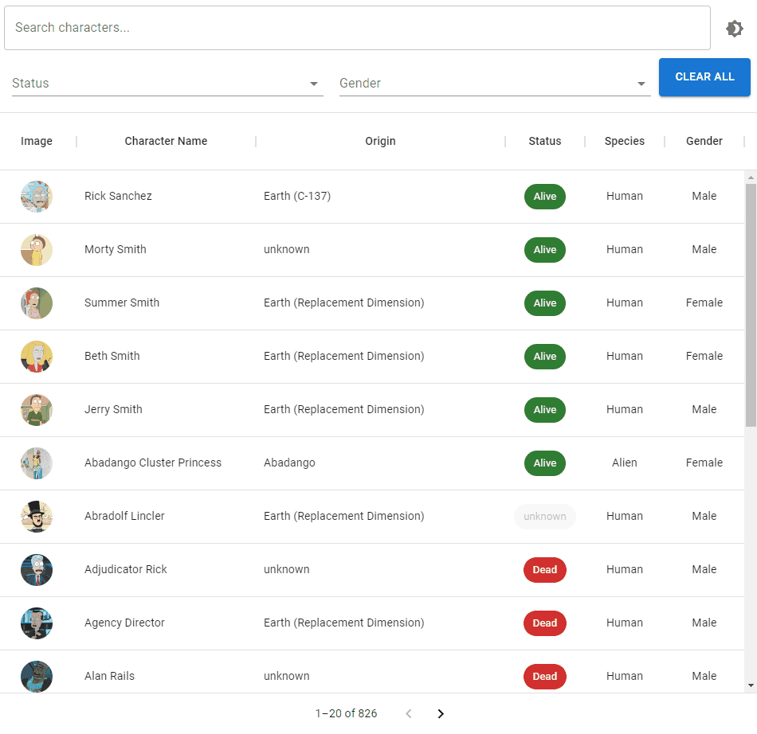
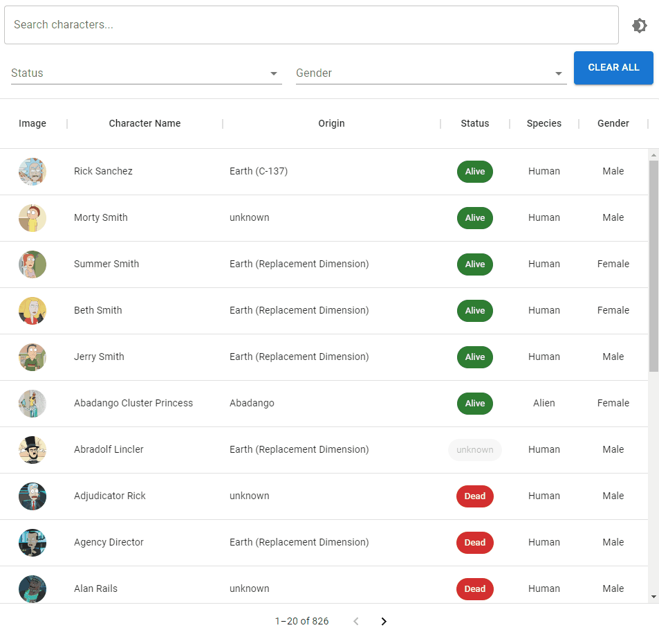

# Rick & Morty Characters App

[Task Instructions](https://gist.github.com/jacobra19/180a0d4b623fbc7c80a2209e89295ed3)

## Table of Contents

- [Libraries used in this project](#libraries-used-in-this-project)
- [Features](#features)
- [Demo](#demo)

## Libraries used in this project

- [React](https://reactjs.org/)
- [Material-UI](https://mui.com/)
- [Rick & Morty API](https://rickandmortyapi.com/)
- [React Query](https://react-query-v2.tanstack.com/)

## Features

- [Pagination using react-query](#pagination)
- [Search mechanism (with debounce)](#search-and-filter)
- [Filter mechanism (hard coded options)](#search-and-filter)
- [Dialog modal (more details on the character)](#dialog)
- [Not found message - 404](#404---not-found)
- [Dark mode](#dark-mode)
- [Mobile friendly](#mobile-friendly)

## Demo

### Pagination

### Search and Filter

### Dialog

### 404 - Not Found

### Dark Mode

### Mobile Friendly

